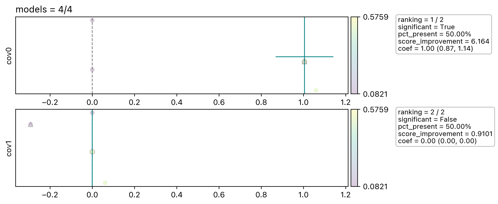

==========
Quickstart
==========

Example
-------

Here we proivde a simple example and more explanation be in the following sections.

.. code-block:: python

    import pandas as pd
    from modrover.api import Rover

    # sample data
    data = pd.DataFrame({
        "obs": [1.0, 2.0, 3.0, 4.0, 5.0],
        "cov0": [1.1, 2.1, 2.8, 3.6, 5.2],
        "cov1": [6.1, 2.2, 1.6, 5.8, 0.5],
        "holdout0": [0, 0, 0, 0, 1],
        "holdout1": [1, 0, 0, 0, 0],
    })

    # create rover object
    rover = Rover(
        model_type="gaussian",
        obs="obs",
        cov_fixed=["intercept"],
        cov_exploring=["cov0", "cov1"],
        holdouts=["holdout0", "holdout1"],
    )

    # fit and predict
    rover.fit(data=data, strategies=["full"], top_pct_learner=0.5)
    pred = rover.predict(data)

    # plot the spread of the coefficients
    fig = rover.plot()

    # learner information and the summary of the ensemble information
    learner_info = rover.learner_info
    summary = rover.summary

Data
----

ModRover works with data in the form of the Pandas data frames. In the dataset,
we need to provide the observations, covariates of interest, other important
information, e.g. the weight of the data point and the holdout columns for
computing the out-of-sample performance.

Rover
-----

Rover is the main class that user need to interact with. Here we provide
description of the arguments in the example. For more details please check the
:ref:`API Reference`.

* :code:`model_type` corresponding to the model family, currently we provide classical choices :code:`{"gaussian", "poisson", "binomial"}`
* :code:`obs` is the column name in the dataset corresponding to the observations
* :code:`cov_fixed` is the list of column names corresponding to the covariates user want to include in all of the learners. The most common choice is :code:`["intercept"]`, which indicate every learner will have the intercept as part of its covariates. (User don't have to create :code:`"intercept"` in their dataset, it will be automatically generated)
* :code:`cov_exploring` is the list of column names corresponding to the covariates user want to test the inclusion.
* :code:`holdouts` is the list of column names corresponding to the indicators of holdout. The column should contain only 0 or 1, where 0 marks the row as the training data and 1 for testing data. This set of columns will be used to divide the training and testing data and evaluate the out-of-sample performance.

Rover.fit
---------

After creating the rover instance, we can call :code:`fit` function to fit all the base learners and ensemble the super
learner. For more details please check :ref:`API Reference`.

* :code:`data` is the dataframe that contains all necessary columns defined in the rover object previously
* :code:`strategies` is a list of strings corresponding to the strategies we want to use to explore the model space. Currently the strategy provide are :code:`{"full", "forward", "backward"}`, where :code:`"full"` will fit every possible covariate-combinations in :code:`cov_exploring`. In this example since we only have two covariates, there are only four possibilities, we can afford to fit all combinations. Usually when we have lots of covariates :code:`"forward"` and :code:`"backward"` are more suitable options. :code:`"forward"` strategy starting with the model only include the covariates in :code:`cov_fixed` and add one covariate at a time depending on the model performance. And :code:`"backward"` strategy start with the model include all covariates in :code:`cov_fixed` and :code:`cov_exploring` and remove one covirate at a time depending on the model performance. These two strategies allow us to explore the model space more efficiently rather than go through every poissible combination.
* :code:`top_pct_learner` is an ensemble option. In this example, we will only include the top 50% of the fitted models according to their score to ensemble the super learner. The other two ensemble options are, :code:`top_pct_score` and :code:`coef_bounds`.

After fitting the model, we will be able to access the super learner. To get the estimated coefficients and the variance-covariance matrix,

.. code-block:: python

    >>> rover.super_learner.coef
    array([0.02527973, 1.00497306, 0.        ])
    >>> rover.super_learner.vcov
    array([[ 0.0306691 , -0.01050203,  0.        ],
           [-0.01050203,  0.00474495,  0.        ],
           [ 0.        ,  0.        ,  0.        ]])

Rover.predict
-------------

:code:`Rover.predict` is used to generate predictions. User need to make sure to include all covariate columns. If we specify the arguments as in the example, the function will return a single array as the prediction. If we also want the uncertainty interval, we need to set :code:`return_ui=True`. By default it will return the point prediction and the 95% uncertainty interval, if we want 90% uncertainty interval, we can specify :code:`alpha=0.1`.

.. code-block:: python

    >>> rover.predict(data)
    array([1.1307501 , 2.13572317, 2.83920431, 3.64318276, 5.25113966])
    >>> rover.predict(data, return_ui=True)
    array([[1.1307501 , 2.13572317, 2.83920431, 3.64318276, 5.25113966],
           [0.90466489, 1.966146  , 2.65266606, 3.39104678, 4.81396876],
           [1.35683532, 2.30530033, 3.02574256, 3.89531874, 5.68831056]])

Rover.plot
----------

:code:`Rover.plot` create a diagnostic plot of the spread of the coefficients across different learners. It gives us a general sense of how sensitive the covariate coefficients are depending on the covariates we include in the model.

Each row panel corresponding to one covariate in :code:`cov_exploring`.
In this example we will only see four dots in each panel. We only have two covariates and it produces in-total four base
learners. The points are arrange horizontally by their coefficients value and vertically by random value.
The triangle marker marks the model only include :code:`cov_fixed` and the corresponding covariate. The circle marker
marks the final learners included in the ensemble. The vertical and horizontal teal line mark the ensembled coefficents
and their uncertainty. And there are more information plotted in the text box.

Diagnostics
-----------

At last, rover also provide two diagnostic data frame to help user track the status and results.

Learner Info
~~~~~~~~~~~~
:code:`rover.learner_info` contains all the status of all the learners and if they are valid to be included in the final
ensemble.

.. csv-table::
    :file: tables/quickstart_learner_info.csv

Here :code:`learner_id` encode the covariates configuration. In this example, :code:`(,)` corresponding to the model
only includs :code:`intercept`, :code:`(0,)` is for :code:`intercept + cov0` and :code:`(0, 1)` is for :code:`intercept + cov0 + cov1`.

Summary
~~~~~~~
:code:`rover.summary` contains covariates information of the final ensemble.

.. csv-table::
    :file: tables/quickstart_summary.csv